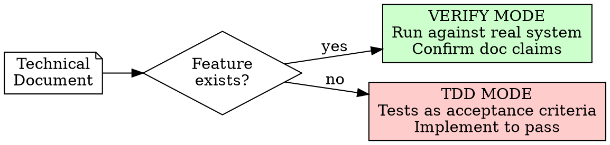
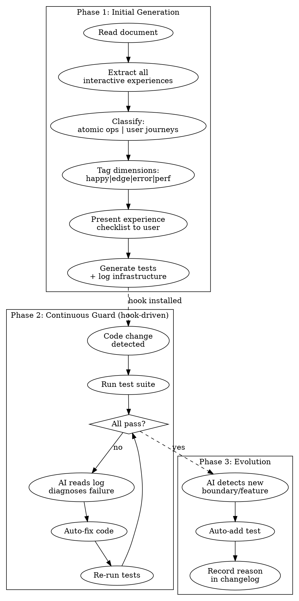

# Doc to Experience Tests

## Overview

Transform any technical document into an independent, self-sustaining test suite that represents **real user experiences** — not documentation compliance checks.

**Core principle:** Tests are the product's second truth. Documents are the initial plan; tests are how users actually use the product. Once generated, tests are independent — they don't serve the document, they serve the user experience.

## When to Use

- Given a technical document, need full test coverage of all interactive experiences
- Existing product evolving, need new tests for new boundaries
- Major refactor coming, need experience tests as guardrails
- AI needs replay-level logs to monitor/debug test execution

**NOT for:**
- Unit tests for internal implementation details
- Mocking-heavy tests that don't represent real interactions
- One-off debugging (use systematic-debugging instead)

## Two Modes



## Complete Lifecycle



## Phase 1: Experience Extraction

### Step 1: Read and Parse Document

Identify every interactive experience point:
- API calls (REST, GraphQL, WebSocket, gRPC)
- UI interactions (click, input, navigate, drag)
- CLI commands (flags, pipes, redirects)
- Data flows (input → transform → output)
- Event sequences (trigger → propagate → handle)

### Step 2: Classify into Two Layers

| Layer | Granularity | Example |
|-------|------------|---------|
| **Atomic Operations** | Single function/endpoint/action | "Create a resource", "Query list", "Delete item" |
| **User Journeys** | Multi-step real workflows | "Register → Configure → Use → Export" |

### Step 3: Tag Coverage Dimensions

Each experience point gets 4 dimensions:

| Dimension | What to test |
|-----------|-------------|
| **Happy path** | Normal successful usage as documented |
| **Edge cases** | Boundary values, empty inputs, max limits, Unicode, concurrent access |
| **Error paths** | Invalid inputs, auth failures, network errors, timeouts, rate limits |
| **Performance** | Response time, throughput, memory usage under documented constraints |

### Step 4: Present Checklist

Output structured checklist for user confirmation. User can add/remove/modify before generation proceeds.

### Step 5: Auto-Detect Tech Stack

Choose framework based on document content:
- Python APIs/SDKs → pytest + httpx/aiohttp
- JavaScript/TypeScript → Vitest/Jest + fetch/axios
- CLI tools → shell scripts + expect
- Mixed → primary language of the documented system
- Protocol testing → language-appropriate client library

### Step 6: Generate Tests + Log Infrastructure

Generate:
1. Test files (organized by layer: `atomic/` and `journeys/`)
2. Log infrastructure (structured JSON logger)
3. Diagnostic collector (auto-collects env info on failure)
4. Test runner config (with hook integration points)
5. Changelog file (tracks all test evolution)

## Log Structure (JSONL per test run)

Every test emits replay-level structured events:

```jsonl
{"test_id":"atomic_001_create_resource","ts":"2026-05-08T10:23:45.123Z","phase":"setup","step":1,"action":"init_env","detail":{"runtime":"node20","os":"darwin","memory_mb":8192}}
{"test_id":"atomic_001_create_resource","ts":"2026-05-08T10:23:45.200Z","phase":"execution","step":2,"action":"http_request","input":{"method":"POST","url":"/api/resources","headers":{"content-type":"application/json","authorization":"Bearer ***"},"body":{"name":"test-resource"}}}
{"test_id":"atomic_001_create_resource","ts":"2026-05-08T10:23:45.342Z","phase":"execution","step":3,"action":"http_response","output":{"status":201,"headers":{"x-request-id":"abc123"},"body":{"id":"res_001","name":"test-resource","created_at":"..."},"duration_ms":142}}
{"test_id":"atomic_001_create_resource","ts":"2026-05-08T10:23:45.343Z","phase":"assertion","step":4,"action":"assert_eq","field":"status","expected":201,"actual":201,"passed":true}
{"test_id":"atomic_001_create_resource","ts":"2026-05-08T10:23:45.344Z","phase":"summary","status":"pass","total_duration_ms":221,"assertions_passed":4,"assertions_failed":0}
```

### On Failure — Auto-Diagnostic Collection

```jsonl
{"test_id":"atomic_001_create_resource","ts":"...","phase":"diagnostic","action":"env_snapshot","data":{"cpu_usage_pct":45,"memory_free_mb":2048,"disk_free_gb":50,"network_latency_ms":12}}
{"test_id":"atomic_001_create_resource","ts":"...","phase":"diagnostic","action":"error_detail","data":{"error_type":"TimeoutError","message":"Request exceeded 5000ms","stack":"...","request_id":"abc123"}}
{"test_id":"atomic_001_create_resource","ts":"...","phase":"diagnostic","action":"related_context","data":{"recent_changes":["src/api/resources.ts:L42"],"similar_failures":["atomic_002 failed 2 runs ago with same error"]}}
```

### Log Phases

| Phase | Purpose |
|-------|---------|
| `setup` | Environment initialization, dependencies, fixtures |
| `execution` | Actual interaction (request/response, UI action, command) |
| `assertion` | Each assertion with expected vs actual |
| `teardown` | Cleanup actions |
| `diagnostic` | Auto-collected on failure only |
| `summary` | Final pass/fail with timing |

## Phase 2: Continuous Guard

### Hook Integration

Tests auto-run after code changes. Configure as Claude Code hook:

```json
{
  "hooks": {
    "PostToolUse": [{
      "matcher": "Edit|Write",
      "command": "run-experience-tests --changed-only --log-dir logs/experience/"
    }]
  }
}
```

### AI Auto-Fix Loop

When tests fail:
1. Read structured log (JSONL)
2. Identify root cause from diagnostic data
3. Fix implementation code (NOT the test, unless test is outdated)
4. Re-run affected tests
5. Repeat until pass or max retries (3)

### AI Real-Time Monitoring

For long-running test suites, AI can monitor in real-time:
```bash
tail -f logs/experience/current.jsonl | grep --line-buffered '"phase":"summary"'
```

## Phase 3: Test Evolution

### When to Add Tests

AI automatically adds tests when:
- New feature code is written that has no corresponding experience test
- A bug is fixed (add regression test)
- Edge case discovered during auto-fix (add boundary test)
- Performance characteristic changes (add performance assertion)

### When to Modify Tests

Tests can evolve, but ALWAYS record why:
- Product behavior intentionally changed
- API contract updated
- Performance baseline shifted
- Feature deprecated/removed

### Changelog Format

```jsonl
{"ts":"2026-05-08","test_id":"atomic_001","action":"created","reason":"Initial generation from API docs section: Resource Management"}
{"ts":"2026-05-10","test_id":"atomic_001","action":"modified","reason":"Product added rate limiting (100 req/min), adjusted expected 429 response after burst"}
{"ts":"2026-05-12","test_id":"journey_003","action":"added","reason":"Discovered users retry after step-2 failure; added retry-recovery journey"}
{"ts":"2026-05-15","test_id":"atomic_007","action":"removed","reason":"Feature deprecated in v2.0, replaced by atomic_012"}
```

## File Structure Output

```
tests/experience/
  atomic/
    test_create_resource.{ext}
    test_query_list.{ext}
    test_delete_item.{ext}
    ...
  journeys/
    test_onboarding_flow.{ext}
    test_data_export_pipeline.{ext}
    ...
  infrastructure/
    logger.{ext}           # Structured JSON logger
    diagnostics.{ext}      # Auto-diagnostic collector
    runner_config.{ext}    # Test runner configuration
  logs/
    current.jsonl          # Current/latest run (for real-time monitoring)
    history/
      2026-05-08T10-23-45.jsonl
      ...
  CHANGELOG.jsonl          # Test evolution history
  EXPERIENCE_MAP.md        # Human-readable summary of what's tested
```

## Quick Reference

| Need | Action |
|------|--------|
| Generate tests from doc | Invoke this skill with document path |
| Run all experience tests | `run-experience-tests --all` |
| Run changed-only | `run-experience-tests --changed-only` |
| Monitor real-time | `tail -f logs/experience/current.jsonl` |
| See test evolution | Read `CHANGELOG.jsonl` |
| Add test manually | Create in appropriate layer, log to changelog |
| Check coverage gaps | Read `EXPERIENCE_MAP.md` |

## Common Mistakes

| Mistake | Fix |
|---------|-----|
| Testing implementation details instead of user experience | Ask "would a user do this?" — if no, don't test it |
| Mocking everything | Use real interactions; mocks hide real failures |
| Sparse logs that don't capture the full picture | Every step gets a log event; on failure, auto-collect diagnostics |
| Modifying tests without recording why | Always append to CHANGELOG.jsonl with reason |
| Treating test failures as test bugs | Default assumption: code is wrong, not the test. Only modify test if product intentionally changed |
| Running full suite on every tiny change | Use `--changed-only` for hook; full suite for major changes |
